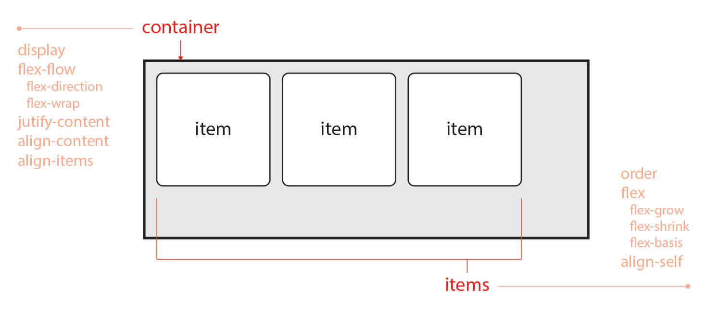
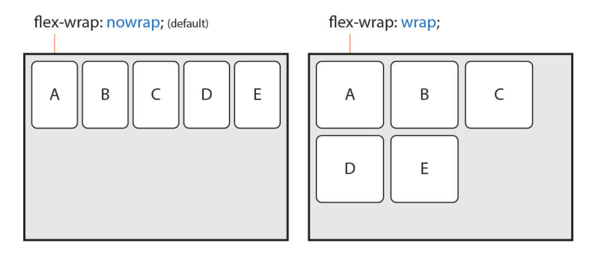
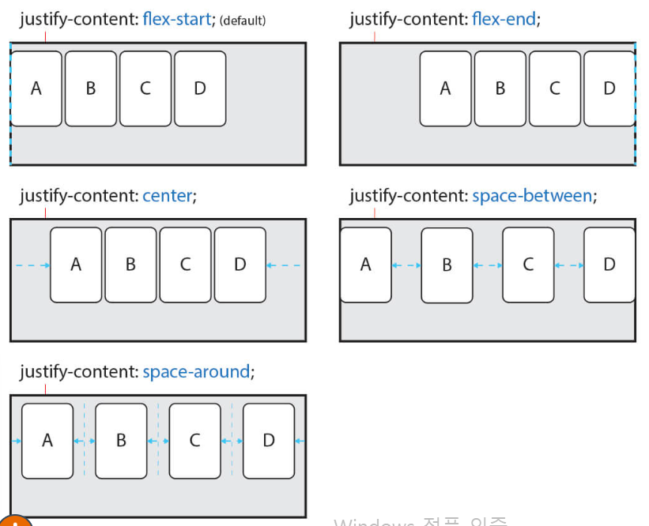
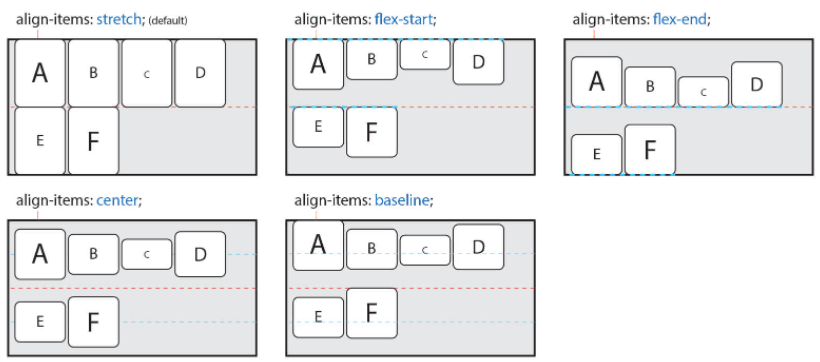
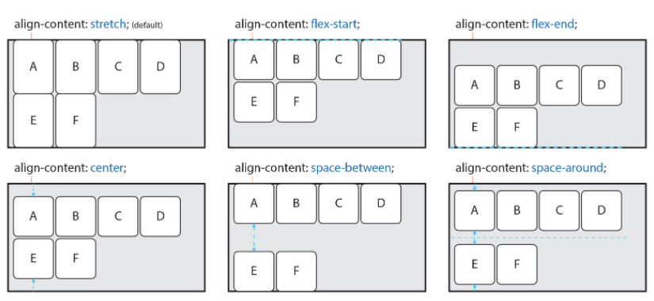
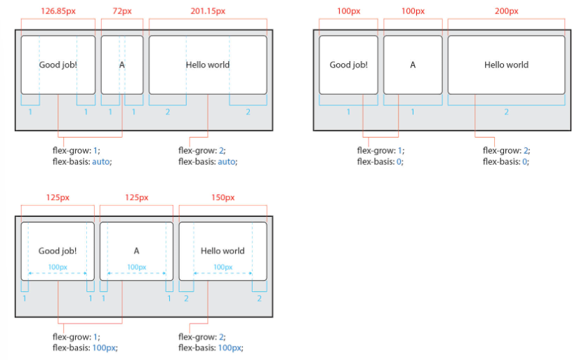
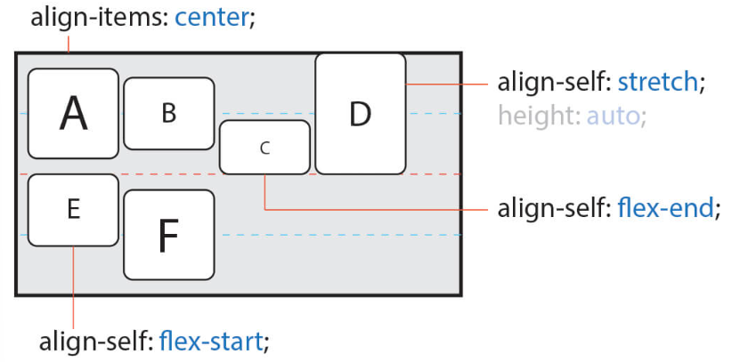

# Flex

- Container(부모)에 적용하는 속성
  - `display: flex`
  - `flex-flow: flex-direction flex-wrap`
  - `justify-content`
  - `align-items`  
- item(자식)에 적용하는 속성
  - `flex: flex-grow flex-shrink flex-basis`  
  - `align-self`

# container
## `display: flex`
자식들을 가로로 배열하면서, 쪼그라들게 한다.
## `flex-flow: flex-direction flex-wrap`
- `flex-direction` 기본속성 row -> column 등  
    row일땐 주 축이 가로
    column일땐 주 축이 세로
- `flex-wrap` 기본속성 nowrap -> wrap  
    nowrap일땐 자식들을 모두 한 줄에 표시(by 자식들의 지정된 크기 무시)  
    wrap일땐 여러 줄로도 묶음(by 자식들의 지정된 크기 고려)  
      
## `justify-content`
주 축 방향의 정렬 방법  
기본속성 flex-start -> center, flex-end 등  

## `align-items`
주 축의 반대 축 방향의 정렬 방법  
기본속성 stretch -> center 등  
  
만약, wrap을 통해 여러 줄일 경우에는 align-content를 사용
  

# item
## `flex축약형`
- flex-grow : 증가될 때 가져갈 너비의 비율
- flex-shrink : 감소될 때 빼앗길 너비의 비율
- flex-basis : 증감 전의 기본 너비값 설정
- `flex: 1` = `flex: 1 1 0` 이라는 것!  

## `align-self`
item들 마다 개별로 정렬 방법 설정  

---
# 참조
https://heropy.blog/2018/11/24/css-flexible-box/
